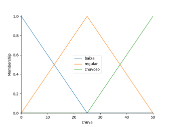

### Documentação da lógica Fuzzy


---

###### Introdução

O trabalho visa de forma simplificada usar lógica fuzzy em Python para determinar a melhor época para o plantio de soja no Distrito Federal. Foram usadas bibliotecas do kit científico de python(SciPy) orientadas à lógica fuzzy e funções de pertinência triangulares.

Com este projeto pretendemos alcançar um domínio prático sobre a programação de lógica fuzzy e técnicas usadas no Python.


###### Bibliotecas utilizadas

```python
import matplotlib.pyplot as plt ## Utilizada para desenhar gráficos
import os ## Utilizada para localizar o path do dataset em qualquer ambiente
import numpy as np ## Permite trabalhar com arrays e matrizes
import skfuzzy as fuzz ## Fuzzy Logic SciKi, toolkit de fuzzy do Scipy
import time ## Tempo de execução
import json ## Para importar o dataset
from skfuzzy import control as ctrl ## Módulo de controle para as regras fuzzy
```

- Definimos as nossas entradas e saídas usando o módulo de controle

- Um array [0,51,1] define uma pertinencia de 0 ... 1 e um total de 50 unidades de grandeza(0 ... n | n-1)
  
  ```python
  chuva = ctrl.Antecedent(np.arange(0, 51, 1),'chuva')
  temperatura = ctrl.Antecedent(np.arange(0, 51, 1),'temperatura')
  crescimento = ctrl.Consequent(np.arange(0, 61, 1),'crescimento')
  ```

- Definimos o universo das nossas variáveis nos conjuntos fuzzy triangulares

- Um array triangular representa o início, meio e fim do triangulo

- O array [0,0,25] determina que o início e o meio do triangulo estão na posição x = 0, enquanto o final está na posição 25 (Imagem abaixo)
  
  
  
  ```python
  chuva['baixa'] = fuzz.trimf(chuva.universe, [0, 0, 25])
  chuva['regular'] = fuzz.trimf(chuva.universe, [0, 25, 50])
  chuva['chuvoso'] = fuzz.trimf(chuva.universe, [25, 50, 50])
  
  temperatura['baixa'] = fuzz.trimf(temperatura.universe, [0, 0, 25])
  temperatura['media'] = fuzz.trimf(temperatura.universe, [0, 25, 50])
  temperatura['alta'] = fuzz.trimf(temperatura.universe, [25, 50, 50])
  
  crescimento['baixo'] = fuzz.trimf(crescimento.universe, [0, 0, 30])
  crescimento['medio'] = fuzz.trimf(crescimento.universe, [0, 30, 60])
  crescimento['alto'] = fuzz.trimf(crescimento.universe, [30, 60, 60])
  ```

***Definição das regras*:**

A soja precisa de calor e frio moderados para se desenvolver de forma saudável, em climas secos ela tende a não se desenvolver de forma adequada, causando prejuízos ao produtor.

A soja se adapta melhor às regiões onde as temperaturas oscilam entre 20ºC e 30ºC sendo que a temperatura ideal para seu desenvolvimento está em torno de 30ºC

1. Se a chuva é baixa e a temperatura é média, então o crescimento será médio

2. Se o temperatura é média e a chuva regular, então o crescimento será alto

3. Se o temperatura é alta e a chuva regular, então o crescimento será medio

4. Se a chuva é baixa ou a temperatura baixa, então o crescimento será baixo

```python
regra1 = ctrl.Rule(chuva['baixa'] & temperatura['media'], crescimento['medio'])
regra2 = ctrl.Rule(temperatura['media'] & chuva['regular'], crescimento['alto'])
regra3 = ctrl.Rule(temperatura['alta'] & chuva['regular'], crescimento['medio'])
regra4 = ctrl.Rule(chuva['baixa'] | temperatura['baixa'], crescimento['baixo'])
```

O sistema de controle recebe um array com nossas regras e depois esse sistema é simulado.

```python
fatorCrescimento_ctrl = ctrl.ControlSystem([regra1, regra2, regra3, regra4])
fatorCrescimento = ctrl.ControlSystemSimulation(fatorCrescimento_ctrl)
```

O bloco abaixo é onde é feita a busca pelo melhor caso no dataset. Nosso dataset em formato json é aberto e definimos uma escala de redução, pois os dados vem em precipitação em milímetros, e como definimos o universo "chuva" como n=51, sendo que (0 ... n | n-1) define as unidades de grandeza, não podemos receber dados acima de 50. A escala de redução garante que qualquer valor em mm do dataset seja convertido e não ultrapasse o nosso n-1.

```python
with open(dataset_path, 'r') as ds:
        dataset = json.loads(ds.read())
        escalaReducao = 0.17605633802
        aux = 0
```

No statement for, percorremos os meses do dataset, lemos os dados de temperatura e precipitação pluviométrica de cada mês e os computamos chamando o médoto compute() logo depos de popular nossa variável "fatorCrescimento" com a temperatura e a precipitação do mês atual.

```python
for i in dataset['meses']:
            fatorCrescimento.input['chuva'] = (
                i['Precipitacao'] * escalaReducao)
            fatorCrescimento.input['temperatura'] = (i['TemperaturaMed'])
            fatorCrescimento.compute()
```

 A saída é o nosso grau de crescimento, que é comparado no statement if. Quando acharmos  o melhor grau de crescimento(em grandeza), salvamos  os dados do mês escolhido.

```python
if fatorCrescimento.output['crescimento'] > aux:
                precipitacao = (i['Precipitacao'] * escalaReducao)
                temperaturaAux = (i['TemperaturaMed'])
                mes = (i['Mes'])
                aux = fatorCrescimento.output['crescimento']
```

Finalmente computamos o fator de crescimento com os dados escolhidos e geramos os gráficos.

```python
fatorCrescimento.input['chuva'] = precipitacao
fatorCrescimento.input['temperatura'] = temperaturaAux
fatorCrescimento.compute()
## Gráficos
temperatura.view(sim=fatorCrescimento)
chuva.view(sim=fatorCrescimento)
crescimento.view(sim=fatorCrescimento)
plt.show()
```

###### *Conclusão*:

O projeto fluiu bem. As bibliotecas do Python são bem documentadas, opensource e possuem uma grande comunidade online. Os dados de saída do projeto coincidiram com pesquisas na internet(Melhor plantio no mês de Outubro). Usamos um dataset de média de temperatura e precipitação da ANA(Agência Nacional de Águas), que foi um pouco problemático mas que não se provou um desafio na conclusão do projeto.


***Bibliografia***:

Como fazer o plantio de soja. Disponível em<[https://novonegocio.com.br/rural/plantio-de-soja/](https://novonegocio.com.br/rural/plantio-de-soja/)>. Acessado em 15 de Maio de 2019.

Agência Embrapa de Informação e Tecnologia. Disponível em <[https://www.agencia.cnptia.embrapa.br/gestor/soja/arvore/CONT000fzr67cri02wx5ok0cpoo6aeh331my.html](https://www.agencia.cnptia.embrapa.br/gestor/soja/arvore/CONT000fzr67cri02wx5ok0cpoo6aeh331my.html)>. Acessado em 15 de Maio de 2019.

SciKit-Fuzzy documentation. Disponível em<[https://pythonhosted.org/scikit-fuzzy/overview.html](https://pythonhosted.org/scikit-fuzzy/overview.html)>. Acessado em 15 de maio de 2019.

Docs e exemplos no repositório oficial da library no GitHub. Disponível em<[https://github.com/scikit-fuzzy/scikit-fuzzy/tree/master/docs](https://github.com/scikit-fuzzy/scikit-fuzzy/tree/master/docs)>. Acessado em 15 de maio de 2019.


